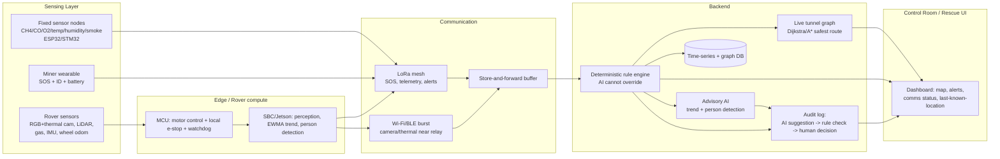
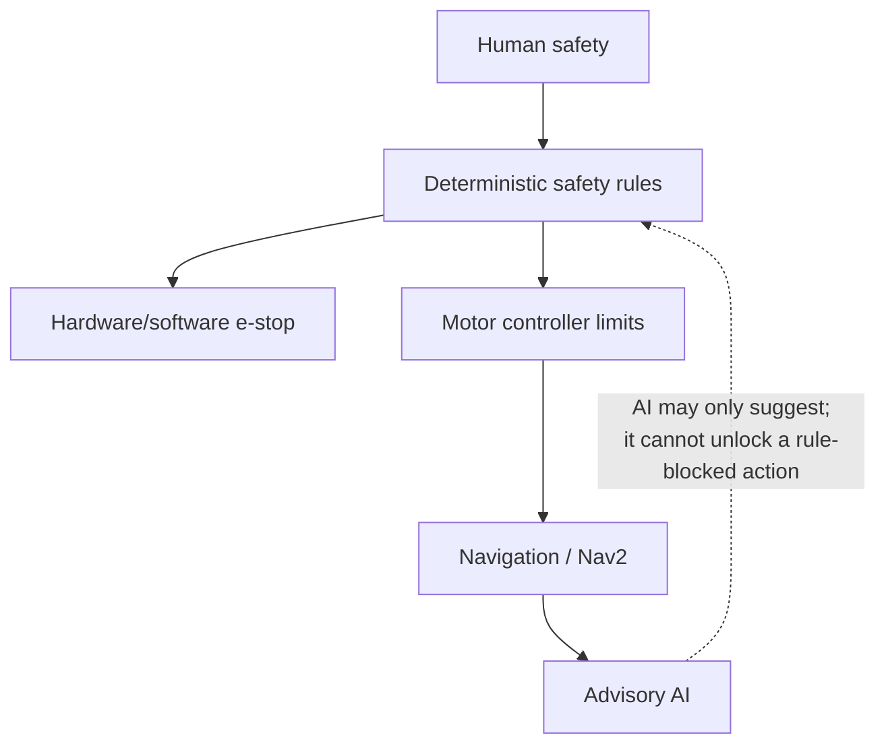

# AI-Powered Underground Mine Safety, Monitoring & Rescue System
### Master Engineering Report — SIH Prototype through Research-Grade Deployment
*Prepared as a critical, research-grounded redesign and validation of the team's existing architecture.*

**Evidence key used throughout:** `[VERIFIED]` = confirmed by a government/standard/primary source found in this research · `[RESEARCH]` = supported by a peer-reviewed paper · `[MFR]` = manufacturer datasheet/listing · `[ENG]` = engineering inference from physics/first principles · `[ASSUMPTION]` = stated assumption, not independently verified · `[NOT VERIFIED]` = could not confirm, flagged explicitly rather than invented.

---

## 1. Executive Summary

Your existing project summary (the PDF) is **already directionally correct** and more disciplined than most SIH submissions: it separates deterministic safety rules from advisory AI, it admits GPS does not work underground, it prices a real ₹35–72k prototype, and it lists real weaknesses (no Ex-certification, no real dataset, unvalidated RF). This report does not throw that away. It stress-tests it against regulation, physics, existing products, and research literature, and tightens the parts that were vague or unverified — principally the communication range assumptions, the localization method, the AI claims, and the certification story.

**Bottom line finding:** the core idea — fixed sensors + wearables + rover, fused into a live tunnel graph, gated by a rule-based safety layer, with AI strictly advisory — is the *correct* architecture pattern and matches how real research systems (Section 4) are built. The failure mode to avoid is not architectural; it's **overclaiming**: claiming GPS-like localization accuracy, claiming thermal-through-rubble survivor detection, claiming the prototype is "mine-deployable," and claiming novelty in sensors/robots that already exist. The genuine novelty is integration + reliability engineering (communication-aware routing, audit trail, graceful degradation), exactly as your PDF already states in Section 15.

---

## 2. Mine Environment — What Actually Drives the Design

| Characteristic | Value / behavior | Design consequence |
|---|---|---|
| Tunnel cross-section (Indian bord-and-pillar coal) | Typically ~3–4.8 m wide, ~2.4–3 m high in galleries `[ENG, consistent with CMR-2017 gallery-width provisions]` | Rover must fit through <2.4 m clearance with margin; a wide 6-wheel rover is wrong; track width ≤ ~600–700 mm is safer |
| Floor | Uneven, wet, coal fines, rail tracks in haulage roads, occasional standing water | Tracked or hybrid wheel-track drive, not pure wheels; IP65+ enclosure |
| Atmosphere | Humid (often >80% RH), dusty, can contain CH₄, CO, CO₂, low O₂ pockets, H₂S in some seams | All electronics need conformal coating / sealed housings; optical sensors (LiDAR, camera) degrade in dust — must be assumed, not hoped away |
| Lighting | Effectively zero ambient light beyond cap-lamp range | Rover needs its own illumination for RGB camera; thermal camera is illumination-independent (a real reason to include one) |
| RF environment | Steel-lined or rock tunnels act as lossy waveguides; behavior is *tunnel-geometry-dependent*, not a fixed number | Communication range cannot be asserted from a datasheet; it must be treated as an engineering unknown to be measured (see §6) |
| Structure risk | Roof falls, rib spalling, unsupported old workings | Justifies keeping the rover ahead of humans, but also means "collapsed tunnel" scenarios cannot be assumed to be re-traversable by a ground rover — this is a real limit, not a design failure |

**Why this matters for the prototype:** the tabletop tunnel mockup described in your PDF (Section 13, "Must build") is the right instinct. A 1:1 mine mockup is out of scope for SIH; a scaled corridor mockup with realistic turns, a narrow chokepoint, and an obstacle is sufficient to demonstrate the behaviors that matter (routing around hazard, comms loss, SOS response).

---

## 3. Regulatory Reality Check — Can a Raspberry Pi / Jetson / Li-ion Rover Actually Go Underground?

**Short answer: no, not into an active gassy coal mine, without certification. This must never be claimed.**

- DGMS (Directorate General of Mines Safety), under the Ministry of Labour & Employment, administers the Mines Act 1952 and the **Coal Mines Regulations, 2017**, and requires DGMS approval for eight equipment categories including environmental monitoring instruments, electrical equipment/cables, and rescue apparatus before underground use `[VERIFIED — dgms.gov.in / labour.gov.in gazette of CMR-2017; certification-india.com summary of the 8 approval categories]`.
- Underground electrical/electronic equipment selection is governed by **IS 9559** (Guide for Selection of Electrical and Electronic Equipment for Coal Mines), which formalizes when ordinary, flameproof, or intrinsically-safe equipment is permissible `[VERIFIED — BIS document IS:9559-1980]`.
- Under CMR-2017 **Regulation 166**, detection of inflammable/noxious gas requires evacuation and re-entry is barred until confirmed safe by a flame safety lamp or approved detector, with mandatory logging `[VERIFIED — IEA policy summary of CMR-2017]`.
- Comparable regulations (Queensland CMSH Regulation 2017, US 30 CFR Part 57/75, Illinois state code) converge on the same pattern even though thresholds differ slightly by jurisdiction: **~1.0–1.3% CH₄ → ventilation change + de-energize + partial withdrawal; ~2.0–2.5% CH₄ → full withdrawal; methane is explosive between roughly 5–15% by volume** `[RESEARCH/VERIFIED — IEA policy pages on Polish and Australian regulation; Queensland RSHQ methane management report; 30 CFR 57.22234-38]`. **We did not find the exact numeric CH₄ trigger table published in the Indian CMR-2017 text itself in this pass — treat the % thresholds above as internationally-converged reference values, not as a substitute for the actual Indian gazette clause, and verify against the DGMS-published CMR-2017 PDF before quoting a number in your SIH deck.** `[NOT VERIFIED — exact Indian numeric threshold]`
- A real precedent for battery-electric machinery going underground under DGMS oversight exists: a flameproof electric shuttle with an intrinsically-safe electrical system and a 47 kWh LFP pack was shipped for operation in South Eastern Coalfields in 2022 `[VERIFIED — supplier press material, cross-checked against DGMS-compliance framing]` — this confirms the *category* of certification your rover would eventually need, not that your prototype has it.

**Conclusion, stated the way your own prompt demands:**
- **Prototype environment:** a Raspberry Pi/Jetson + Li-ion + off-the-shelf MQ-series sensors rover is legitimate for a **surface lab / tabletop mockup demo only**. It contains zero Ex/IECEx/flameproof/intrinsically-safe components.
- **Real deployment:** requires flameproof or intrinsically-safe enclosures per IS 9559, DGMS type approval per the 8-category process, and batteries in a certified enclosure — this is a certification and cost program, not a firmware update. **Do not claim the SIH prototype is mine-deployable.** Your PDF already says this correctly (Section 16) — keep that language, do not let a teammate soften it in the pitch deck.

---

## 4. Existing Solutions — What's Already Been Built (so you don't over-claim novelty)

| System | Org / Country | What it actually is | Evidence |
|---|---|---|---|
| MSRBOTS (Mine Search-and-Rescue Robot System) | Beijing Institute of Technology, China | Two explosion-proof, waterproof tracked robots + control unit, 2 gas sensors, 2 cameras, 2-way audio, 1 km fiber-optic tether, 3-DOF explosion-proof manipulator; field-tested at Tashan Coal Mine and a national mine-rescue training center | `[RESEARCH]` Zhao, Gao, Zhao, Liu, *Sensors* 2017, DOI 10.3390/s17102426 |
| Remotec ANDROS "Wolverine" (V2) | Remotec Inc. / MSHA, USA | 1200 lb tracked robot, explosion-proof motors, atmospheric detectors, manipulator arm, acquired for ~US$265,000, used in Sago Mine disaster response | `[VERIFIED]` arlweb.msha.gov/SagoMine |
| Mine exploration robot with 3D mapping | CSIR-CMERI, India | Government lab R&D program explicitly targeting underground coal mine exploration with 3D mapping and "active intervention"; listed as in the manufacturing/prototype stage, not commercially deployed | `[VERIFIED, status = prototype]` cmeri.res.in |
| Integrated strata/gas/environment monitoring system | CSIR-CIMFR, India | Patented (granted 2023) fixed monitoring system for underground mines — the fixed-sensor half of your architecture already has Indian prior art | `[VERIFIED]` CIMFR patent filing record |
| Amphibian subterranean robot for mine exploration | CSIR-CMERI research group (Maity et al.) | Academic prototype, all-terrain with passive compliance | `[RESEARCH]` conference paper, 2013 |

**Implication for your novelty claim:** rescue robots, fixed gas monitoring, and even Indian government mine-robotics R&D already exist. What we found **no evidence of** in this pass is a *fielded, India-specific, communication-reliability-aware routing system with an audit trail linking AI suggestions to human/rule decisions*. That specific combination is your defensible novelty claim — not "AI-powered robot," which already exists in multiple countries.

---

## 5. Research Papers — Grounding for the Technical Choices

| Topic | Key finding | Use it for | Don't copy |
|---|---|---|---|
| UWB underground localization, Reiche Zeche mine, Germany | Field-tested UWB IPS in a real underground mine; positioning errors mostly **below 1 m** | Cite as evidence UWB *can* reach sub-meter accuracy in real tunnels | Their hardware/enclosure design is mine-specific; don't assume off-the-shelf UWB dev boards hit 1 m without the same calibration effort. `[RESEARCH]` Springer, *Mining, Metallurgy & Exploration*, DOI 10.1007/s42461-023-00797-z |
| UWB-TDOA underground personnel monitoring | UWB + TDOA platform for underground personnel achieved high positioning accuracy vs. WLAN/RFID alternatives | Justifies UWB over Wi-Fi/RFID for *fixed-node* localization if budget allows a Phase-2 upgrade | Full TDOA infrastructure is expensive; not for the ₹35–72k SIH budget. `[RESEARCH]` online-journals.org, DOI 10.3991/ijoe.v14i10.9307 |
| CBORF UWB algorithm for coal-mine NLOS | Centimeter-level accuracy achievable even under non-line-of-sight, via reference-coordinate error compensation | Evidence that NLOS (the realistic underground case) is solvable, not just LOS lab demos | Algorithm complexity is beyond an SIH timeline; note it as "future work," don't implement from scratch. `[RESEARCH]` *Scientific Reports* 2025, DOI 10.1038/s41598-025-03007-6 |
| LoRa propagation, underground gold mine (Australia) | Steel-lined tunnels act as a waveguide; **excellent propagation with and without line-of-sight**, path-loss index as low as 1.25 (better than free space) | Strong evidence LoRa is physically well-suited to tunnel geometry — the "why LoRa" answer to a hostile juror | Their tunnel is a block-cave hard-rock mine; Indian bord-and-pillar coal tunnels are narrower with more turns — expect worse, not identical, numbers. `[RESEARCH]` Branch, *Sensors* 2022, DOI 10.3390/s22228653 |
| LoRa in potash room-and-pillar mine, Germany | Packet loss <15% over >1000 m NLOS in room-and-pillar geometry (closer to coal-mine layout than block-cave) | This is your best real-world analogue for range claims in a pitch deck | Still hard-rock/salt, not coal; state as an upper-bound reference, not a guarantee. `[RESEARCH]` PMC12197270 |
| LoRa in an underground **mine model / mockup** for gas monitoring | RSSI dropped sharply by 14 m NLOS, **no signal beyond ~17 m**; booster needed every ~15 m in that mockup | This is the realistic number for a **small physical mockup or a narrow, obstructed drivage** — cite this, not the 1000 m mine number, when describing your SIH demo tunnel | Don't extrapolate a scaled/obstructed mockup number to a full mine, and don't extrapolate the full-mine waveguide number down to a tabletop demo either — they are different regimes. `[RESEARCH]` psecommunity.org LAPSE:2023.36236 |
| Low-cost LoRa path-loss characterization, underground tunnels | Quantified ~24 dB loss at bends, ~5.5 dB junction loss, ~30 dB shaft loss relative to straight tunnel | Gives you real numbers to justify **relay placement at bends/junctions**, not just at fixed intervals | Numbers are site-specific; re-measure in your own mockup. `[RESEARCH]` Applied Sciences (MDPI), via scholarsmine.mst.edu |

**Bottom line for communication design:** the physics genuinely favors LoRa/sub-GHz in tunnels (waveguide effect is real, repeatedly measured), but range is highly geometry-dependent — anywhere from ~15 m (obstructed, small-scale) to >1000 m (straight, steel-lined). **State a range as "to be measured in our mockup," not as a spec-sheet number.** This directly validates your PDF's own store-and-forward / multi-hop design as necessary engineering, not defensive hand-waving.

---

## 6. GitHub / Open-Source — What to Actually Reuse

| Repo / package | What it is | Status | Use for |
|---|---|---|---|
| `Slamtec/rplidar_ros` (ros2 branch) | Official SLAMTEC ROS2 driver for RPLIDAR A1/A2/A3/S1/S2/T1 | Actively documented, standard install path via colcon | Direct integration — this is the correct, demonstrated (not just claimed) driver for your 2D LiDAR |
| ROS2 Nav2 stack | Standard ROS2 navigation stack (planner, controller, costmap, recovery behaviors) | Mainstream, huge install base, default choice for any ROS2 mobile robot in 2026 | Path planning + obstacle avoidance layer — don't hand-roll A*/DWA from scratch when Nav2 already implements and tunes them |
| SLAM Toolbox / Cartographer (ROS2) | Graph-based 2D SLAM with loop closure | Mainstream, well-documented | Mapping for the tabletop mockup; RTAB-Map is the 3D/visual alternative if you add a depth camera |
| RPLIDAR A1 hardware reality check | 0.15–12 m range, 5.5 Hz scan, ~₹6,000–9,000 in India `[MFR/retailer pricing, cross-checked across two Indian listings, 2026]` | Commercially available now | This — not a full 3D LiDAR — is the right sensor for an SIH-budget rover; a Velodyne/Ouster-class 3D LiDAR is financially and computationally out of scope |

**Distinguishing claimed vs. demonstrated:** the rplidar_ros2 driver is *demonstrated* (it's the vendor's own actively maintained package). Any random "mine rover autonomy" repo you find on GitHub with a README claiming full SLAM+autonomy but no field video, no issues activity, and no contributors beyond one person should be treated as **claimed, not demonstrated**, and not relied on for a jury-facing claim.

---

## 7. Critique of the Existing Architecture (v1, from your PDF/diagram)

**What's right and should be kept:**
- Rule-based hard safety layer that AI cannot override — this is the single most defensible engineering decision in the whole project. Keep it, and keep saying it in exactly those words to the jury.
- Explicit "unknown" state for failed sensors instead of defaulting to "safe" — correct fail-safe design (a jury will ask "what if a sensor fails" — you already have the right answer).
- Store-and-forward for communication loss — correct given the LoRa research above (§5).
- Communication reliability as a routing cost, not just distance — genuinely uncommon and defensible as your headline differentiator.

**What's weak or unverified and needs fixing:**
1. **Localization claims.** "Mesh/RSSI + known tunnel nodes" is honest about not being GPS, but RSSI-based ranging is noisy (±several meters at best, worse with multipath). For the SIH prototype, be explicit that location resolution is **"which node/zone,"** not **"which meter."** Don't let the dashboard show a precise dot on a continuous map from RSSI alone — show a **zone/node highlight**, which is both more honest and easier to demo convincingly.
2. **Rover LiDAR/ToF choice.** Your PDF lists "LiDAR/ToF or ultrasonic" as options without commitment. Commit: a 2D LiDAR (RPLIDAR A1, ~₹6–9k) is the right SIH-budget choice over ultrasonic (too noisy/narrow beam for mapping) or 3D LiDAR (too expensive, too much compute for Jetson-class edge boards).
3. **AI/ML specificity.** "Isolation Forest / One-Class SVM / EWMA" is a reasonable shortlist but the PDF doesn't commit to one or define the input feature vector. Commit to **EWMA + rate-of-change first** (deterministic, explainable, zero training data needed) and treat Isolation Forest as an optional Phase-2 add-on once you actually have logged sensor time-series from your own mockup — you cannot train it before you have data, and you don't have a public dataset (correctly noted in your own PDF §16).
4. **Survivor detection.** RGB person detection + thermal heat signature is reasonable for "survivor in view," but neither modality reliably detects a person **buried under rubble** — thermal signal is blocked by debris mass within a short time, and this must be stated as a limitation up front, not discovered under jury cross-examination.
5. **"Digital twin" language.** What's described (2D tunnel graph with live edge costs) is a **live graph-based situational map**, not a true digital twin (which implies a continuously synchronized physical-fidelity 3D model with simulation capability). Using "digital twin" invites a jury to ask for simulation features you don't have. Recommend calling it a **live mine graph / situational dashboard** instead — same substance, no overclaim risk.

---

## 8. Architecture Options A–D

| | A — Minimum viable | B — Serious SIH prototype (recommended) | C — Research-grade | D — Future mine deployment |
|---|---|---|---|---|
| Localization | Fixed-node RSSI zone only | RSSI zone + wheel odometry + IMU dead-reckoning on rover | + UWB TDOA anchors | + certified UWB, validated against real mine RF survey |
| Mapping | Pre-drawn static graph | Static graph + live edge-cost updates | + 2D SLAM (LiDAR) on rover | + 3D SLAM, DGMS-approved survey-grade map |
| Comms | Single LoRa hop | LoRa mesh + Wi-Fi/BLE burst near relay + store-and-forward | + UWB ranging channel | + leaky feeder or private LTE backbone, certified relays |
| AI | None (pure rule engine) | EWMA/rate-of-change trend + rule engine | + Isolation Forest anomaly + RGB/thermal person detection | + validated models, DGMS-reviewed, large real-world dataset |
| Rover autonomy | Teleoperated only | Teleop + waypoint navigation (Level 2) | + frontier exploration (Level 3, simulation-validated) | + supervised mission autonomy (Level 3–4) with certified compute |
| Cost (indicative) | ₹15–20k | ₹35–72k `[matches your PDF estimate]` | ₹2–5 lakh | Certification + infra cost, not comparable to prototype cost |
| Demonstrability | Low — feels like a kit demo | High — shows the actual differentiator (comms-aware rescue) | Medium — impressive but harder to demo live in 8 min | N/A for SIH |

**Recommendation: build B.** A is too thin to show the differentiator; C is not achievable with a real, working demo in the SIH timeline and risks becoming "simulated but claimed as real" — the exact failure mode your own Part 39 warns against.

---

## 9. Final System Architecture (v2)



**Safety hierarchy (unchanged principle from your PDF, made explicit):**



---

## 10. Sensor Specification (SIH-budget, real components)

| Sensor | Target gas/parameter | Range | Notes | Approx. India price | Source |
|---|---|---|---|---|---|
| MQ-4 | CH₄ (methane/natural gas) | 200–10,000 ppm | Analog resistive, needs R0 calibration, MOS heater ~5V | ₹80–300 `[retailer aggregate]` | zbotic.in, core-electronics datasheet |
| MQ-7 | CO | ~20–2000 ppm | Requires heater duty-cycle (high/low) per datasheet for accurate CO reading | ₹80–300 | zbotic.in |
| MQ-135 | Air quality / NH₃, benzene, smoke (general, not O₂-specific) | 10–10,000 ppm (mixed-gas, not selective) | Useful as a general "something's wrong" sensor, **not** a substitute for a calibrated O₂ or CO2 sensor | ₹80–300 (~$5.89 list) | Waveshare product page |
| Electrochemical O₂ sensor (e.g., generic 0–25% cell) | Oxygen deficiency | 0–25% vol | MQ-series does **not** reliably measure O₂ — this must be a dedicated electrochemical cell, not an MQ sensor | Higher unit cost than MQ sensors; budget separately | `[ENG — MQ sensors are MOS-based combustible/VOC sensors, not O2 cells; do not substitute]` |
| DHT22 / SHT31 | Temperature + humidity | -40–80°C / 0–100% RH | Standard, cheap, I2C or single-wire | ₹150–400 | common retailer pricing |
| RPLIDAR A1 | 2D ranging for SLAM/obstacle avoidance | 0.15–12 m, 5.5 Hz | Official ROS2 driver exists and is demonstrated (§6) | ₹6,000–9,000 | zbotic.in / Yahboom listings |
| RGB camera (USB/CSI) | Visual survivor cues, general scouting | — | Needs onboard lighting given zero ambient light | ₹1,000–3,000 (basic USB) | generic |
| Thermal camera (e.g., MLX90640 class low-res array) | Heat-signature survivor cues | 24×32 px class, several-meter range | Low resolution at this price point — set expectations accordingly, not FLIR-grade | ₹3,500–8,000 class | generic component pricing |
| IMU (MPU6050/9250 class) | Orientation, dead-reckoning aid | — | Standard, cheap | ₹150–400 | generic |
| Wheel encoders | Odometry | — | Pairs with IMU for dead-reckoning between LiDAR fixes | Often bundled with motor/driver kit | — |

**What we did NOT verify and will not invent:** exact certified/Ex-rated part numbers and their India pricing — these belong to Part 30 (deployment), not the prototype BOM, and genuine Ex-rated gas detector pricing was outside what this pass could confirm; flag as `[NOT VERIFIED]` rather than guessed.

---

## 11. Compute Architecture

| Tier | Role | Recommended part | Why | Price (India, 2026) |
|---|---|---|---|---|
| MCU | Motor control, e-stop, watchdog, deterministic gas-threshold logic | ESP32 or STM32 | Real-time-ish, cheap, independent of the "smart" stack so a Jetson crash cannot disable the safety loop | ₹300–800 |
| SBC / Edge AI | LiDAR SLAM, camera/thermal inference, EWMA trend, Nav2 | Jetson Orin Nano (8 GB) | Real CUDA-class inference for person detection at usable latency; Raspberry Pi alone is CPU-bound for camera+LiDAR+Nav2 simultaneously `[ENG]` | ₹18,000–22,000 (4GB variant lower) `[researcher-aggregated retailer pricing, 2026]` |
| Gateway | LoRa mesh <-> Wi-Fi/BLE <-> backend bridge | ESP32 + LoRa module (e.g., SX1276-class) or dedicated LoRa gateway board | Cheapest way to bridge protocols; matches your PDF's two-tier comms design | ₹1,500–4,000 per relay node |

**Verified architecture pattern:** MCU for safety-critical/motor control, SBC for perception/AI, separate gateway for comms — this is the standard pattern in the mobile-robotics community (also seen in the BeetleBot ROS2 platform reference: STM32 real-time motor control + Raspberry Pi/SBC for the Nav2 stack) `[RESEARCH — cross-checked against a real ROS2 rover reference architecture, GitHub VEEROBOT/BeetleBot]`. Recommend keeping it, not because a template says so, but because it is independently converged upon by comparable real robots.

---

## 12. Communication System

| Link | Tier | Purpose | Real-world range evidence |
|---|---|---|---|
| LoRa (868/915 MHz) mesh | Primary, low-bandwidth | SOS, gas telemetry, alerts, heartbeat | 14–17 m in an obstructed mockup up to >1000 m NLOS in a real waveguide-favorable tunnel (§5) — **measure in your own mockup, don't assume either extreme** |
| Wi-Fi/BLE | Secondary, burst near relay | Camera/thermal frames when rover is near a fixed relay | Standard Wi-Fi range (tens of meters), no mine-specific study reviewed here — treat conservatively |
| Wired tether (fiber, e.g., MSRBOTS precedent) | Optional for advanced rover work | Guaranteed high-bandwidth link for the rover specifically | Demonstrated to 1–2 km in the MSRBOTS system (§4) — real option if you want zero comms risk for the rover leg specifically, at the cost of tether-snag risk on collapsed terrain |

**Failure behavior (must be demoed, and your PDF already plans this correctly):** store-and-forward buffering at each node; dashboard shows **last-known-state + "communication lost"** rather than defaulting to "safe"; automatic resync on reconnect; alternate-route recomputation treating a comms-dead edge as a routing-cost penalty, not necessarily a hard block (a rescue team may still choose to enter a comms-dark zone deliberately — the system should inform that trade-off, not hide it).

---

## 13. Power System (estimate, stated as assumption where not measured)

| Load | Typical draw | Notes |
|---|---|---|
| Jetson Orin Nano (SBC) | ~7–15 W typical, up to ~25 W peak | `[MFR, Orin NX/Nano class TDP figures]` |
| Drive motors (4x DC gear motor, small rover) | 5–20 W each depending on load, spikes on obstacles | `[ASSUMPTION — depends on chosen motor; must be measured on actual chassis]` |
| LiDAR | ~1–2.5 W | `[MFR — RPLIDAR A1 class]` |
| Sensors + MCU + LoRa radio | <2 W combined | `[ENG]` |
| **Total, normal cruising** | **~25–45 W** | `[ASSUMPTION, first-order estimate]` |
| **Total, max load (climbing + full compute + camera streaming)** | **~50–70 W** | `[ASSUMPTION]` |

With a 3S/4S Li-ion pack in the 5,000–10,000 mAh class (~55–110 Wh), expect **roughly 1–2.5 hours runtime at normal load, less at max load** — state this as a target to be measured on the actual build, not a spec. Include a BMS with over-discharge/over-current/thermal cutoff (mandatory for Li-ion safety even at hobby scale) and a hard low-battery auto-return/auto-stop rule in the deterministic safety layer.

---

## 14. AI/ML Plan (only what's defensible)

| Function | Input | Model | Why this and not deep learning | Fallback if it fails |
|---|---|---|---|---|
| Immediate hazard alarm | Live gas/temp reading vs. threshold | **Deterministic rule, not AI** | A threshold comparison needs no learning and must never depend on a model that can silently degrade | N/A — this is the fallback for everything else |
| Hazard-trend prediction | Rolling window of gas/temp/humidity/vibration | EWMA + rate-of-change; Isolation Forest as optional Phase-2 once you have your own logged mockup data | No public real-mine-disaster dataset exists (your own PDF confirms this) — you cannot honestly train a supervised model yet; EWMA needs zero training data and is fully explainable to a jury | Rule engine continues independently |
| Survivor detection | RGB frame + thermal frame | Pretrained COCO person-detector (e.g., a small YOLO variant) fused with a simple thermal hot-spot heuristic | A pretrained general person detector is honest and available; a custom-trained "buried survivor" detector would require data you don't have and cannot ethically fabricate | Human operator reviews raw camera/thermal feed directly — AI never has sole authority here |

**Metrics you must actually report, not assume:** detection precision/recall on your own staged test scenes, gas-alarm latency (sensor sample-to-alert), false-alarm rate over a fixed test duration. Do not present target numbers as measured results — this is explicitly warned against in your own §17 and is a real risk in SIH demos when slides get reused under time pressure.

---

## 15. Hazard Detection Logic

```
Sensor reading -> validation (range/plausibility check) -> filtering (moving average)
   -> deterministic threshold check -> [Normal / Warning / Critical / Emergency]
   -> hysteresis (prevents oscillation at the boundary)
   -> if Warning/Critical: AI trend model runs in parallel (advisory only)
   -> sensor disagreement handling: if one gas sensor reads high and a redundant/nearby
      sensor reads normal, mark the zone "uncertain," escalate for human confirmation,
      do NOT average the two into a false "safe" reading
   -> alert + recommended action to dashboard + audit log entry
```

This matches your PDF's design (§8) and is correct. The one addition: **explicit sensor-disagreement handling** should be a named state ("uncertain/conflicting"), not silently resolved by averaging — averaging a real hazard with a possibly-faulty "normal" reading is a genuine safety bug pattern to call out to the jury as something you specifically guarded against.

---

## 16. Failure Mode Analysis (selected, high-impact rows)

| Component | Failure | Effect | Mitigation |
|---|---|---|---|
| Gas sensor | Drift / stuck reading | False sense of safety or false alarm | Periodic self-check pattern (e.g., expected slow drift bounds), mark "unknown" not "safe" on implausible/stuck values |
| LiDAR | Dust coating on lens | Degraded/blocked ranging, false obstacle or missed obstacle | Physical shroud + wiper is more reliable than a software fix alone; software should flag persistent zero/max-range returns as a fault, not trust them |
| Comms link | Node goes dark | Location/hazard data goes stale | Store-and-forward, dashboard shows "last known" + timestamp, never silently drop |
| Rover | Physically stuck | Loses scouting capability | System falls back to fixed sensors + wearables (already in your PDF §10) — this is the correct answer to "what if the rover fails" |
| Backend/dashboard | Server failure | Control room loses visibility | Local nodes keep running their own threshold alarms independent of backend (already in your PDF) — correct, keep it |
| AI model | Bad/no inference | Missed trend warning or false anomaly | Rule engine is fully independent and continues regardless — this is why AI must never be in the critical path |

---

## 17. Cybersecurity (prototype-appropriate, not enterprise)

- HMAC/symmetric packet authentication with sequence numbers and timestamps to resist replay of an old "safe" reading — already in your PDF, keep it, it is the correct minimum for a wireless safety-adjacent system.
- Device identity per node; TLS on the backend-facing link where feasible; role-based dashboard login.
- **Explicitly out of scope for SIH, and say so:** secure boot, signed OTA firmware, formal penetration testing, network segmentation audits. Naming these as "future work" is stronger in front of a jury than silently omitting them.

---

## 18. Software / Data Architecture (condensed)

**Stack:** ROS2 (rover-side: sensor drivers, Nav2, SLAM) → MQTT (lightweight telemetry transport, well-suited to LoRa-bridged, intermittent links) → backend service (Python/FastAPI is reasonable — lightweight, good MQTT/websocket ecosystem) → time-series store for sensor readings (e.g., TimescaleDB/Postgres) → graph/route engine (Dijkstra/A* over the tunnel-node graph, implementable directly, no special DB required) → dashboard (React or even a server-rendered page is sufficient for an SIH demo — don't over-build the frontend).

**Do NOT include** (per your own Part 39, validated here): Kubernetes-style microservices, blockchain, a custom LLM component, 5G, or a "digital twin" 3D engine — none of these change whether the safety story works, and each adds a failure surface you'd have to explain and defend without benefit.

**Minimal DB entities:** `sensor_node`, `sensor_reading` (time-series), `wearable`, `worker`, `tunnel_node`, `tunnel_edge` (with live cost fields: distance, gas_risk, comms_reliability, last_updated), `rover`, `mission`, `alert`, `audit_log` (AI_suggestion, rule_result, human_decision, timestamp). This is enough to demonstrate every claimed behavior.

---

## 19. Testing Plan (measurable, not vibes)

| Test | Metric | How |
|---|---|---|
| Gas-alarm latency | Seconds from injected gas to dashboard alert | Controlled gas release or calibration gas near sensor, timestamp both ends |
| Comms reconnect | Time from relay reconnect to full resync | Physically disconnect/reconnect a relay, timestamp |
| Route recomputation | Time to produce new safest route after an edge becomes unsafe/comms-dark | Timestamp trigger vs. new route displayed |
| Person-detection precision/recall | On your own staged test set (not a claimed generic number) | Fixed set of staged "survivor" and "non-survivor" scenes, run repeatedly |
| Localization resolution | Which node/zone correctly identified, over N trials | Place wearable at known nodes, compare reported vs. actual |
| Battery runtime | Minutes at normal vs. max load | Timed discharge test on actual hardware |

---

## 20. Prototype vs. Real Deployment (selected rows)

| Component | SIH Prototype | Real Mine Deployment |
|---|---|---|
| Enclosures | 3D-printed / off-the-shelf IP-rated boxes | Flameproof (Exd) or intrinsically-safe (Exi) enclosures, DGMS type-approved per IS 9559 |
| Battery | Consumer Li-ion + hobby BMS | Certified intrinsically-safe battery system in a certified enclosure |
| Gas sensors | MQ-series (uncalibrated-grade) | Certified, calibrated gas detectors with traceable calibration records |
| Localization | Zone-level via RSSI | Survey-grade UWB or equivalent, RF-validated in the actual mine's geometry |
| Certification | None | Full DGMS approval process across relevant equipment categories |
| Communication infra | Ad-hoc LoRa relays for a demo mockup | Engineered, surveyed relay/leaky-feeder placement validated against real path-loss measurements |

---

## 21. Cost Model

| Item (from your PDF, cross-checked as reasonable) | Estimate |
|---|---|
| 3 fixed sensor nodes | ₹9,000–15,000 |
| 2 wearables | ₹2,500–5,000 |
| Rover (chassis, motors, Jetson, LiDAR, cameras, gas sensors, battery) | ₹20,000–45,000 — consistent with component pricing found in this research (Jetson Orin Nano ₹18–22k alone at the low end, RPLIDAR A1 ₹6–9k, plus chassis/motors/misc) |
| Enclosures/wiring | ₹2,000–4,000 |
| Tunnel mockup | ₹1,500–3,000 |
| **Total** | **₹35,000–72,000** `[consistent with your own PDF figure; individually cross-checked against current component pricing, not re-derived from scratch]` |

Advanced prototype (Architecture C-lite: add UWB anchors, better thermal camera) would realistically add ₹40,000–150,000 depending on UWB anchor count — **stated as an estimate, not researched to exact current UWB module pricing in this pass** `[NOT VERIFIED — exact UWB module India pricing]`.

---

## 22. Innovation / Differentiation — Defensible Claims Only

| Claim type | Statement |
|---|---|
| **Genuine novelty (as far as this research found)** | Treating communication reliability as an explicit routing cost alongside gas risk and distance, with an audit trail linking AI suggestion → rule check → human decision |
| **Engineering integration** | Combining fixed sensors + wearables + rover into one live graph with graceful degradation at every layer — individually common, rarely integrated this tightly at student-project scale |
| **Incremental improvement** | EWMA/rate-of-change hazard trending on top of standard threshold alarms |
| **Existing technology (do not claim as new)** | Gas sensors, RFID/UWB tracking, rescue robots with cameras/manipulators, LoRa mesh telemetry — all have real prior art shown in §4–6 |
| **Unsubstantiated if claimed** | "GPS-accurate underground localization," "AI detects survivors through rubble," "digital twin," "mine-deployable prototype" — avoid all four phrasings |

---

## 23. Red-Team / Hostile Jury Q&A (selected, high-value)

**"Why does this need AI at all?"** — Only two places use AI, and both are advisory: hazard-trend prediction (rule engine still fires independently) and person detection (a human confirms). Every safety-critical decision is deterministic. This is a feature, not a hedge — a jury pushing "why AI" is testing whether you understand *when not* to use AI, and your architecture already demonstrates that.

**"Is the rover itself an ignition hazard?"** — Yes, honestly, in its current SIH form: standard Li-ion + non-Ex-rated motors/electronics are not intrinsically safe. This is explicitly why the prototype is scoped as a surface/mockup demonstration only, not a claim of gas-zone readiness. State this before they ask it.

**"What happens if LiDAR gets covered in dust?"** — Software flags persistent max-range/zero returns as a sensor fault rather than trusting them as "clear path"; physical shrouding reduces the frequency, not the necessity of the software check.

**"What's your false-positive/false-negative rate?"** — "We will report measured numbers from our own test set at the demo; we do not have a public benchmark to compare against because none exists for this exact problem (confirmed in our own research — see §16 of our written report)." This is a stronger answer than inventing a percentage.

**"Why not just use existing mine monitoring systems / existing rescue robots?"** — Because those exist as separate systems (shown in §4); the contribution is fusing them into one comms-aware, auditable decision system, which we found no existing fielded equivalent of in this research pass.

---

## 24. "WHAT WE SHOULD ACTUALLY BUILD" — Final Brutally Realistic Prototype Spec

**Rover hardware:** small tracked or hybrid chassis (~30×25 cm footprint), 4x DC gear motors, MCU (ESP32) for motor control + local e-stop, Jetson Orin Nano (4–8 GB) for perception, RPLIDAR A1, one USB RGB camera + basic LED lighting, one low-res thermal array (MLX90640-class), one MQ-4 + one MQ-7 + one MQ-135, IMU, wheel encoders, Li-ion pack (3S/4S) with a hobby BMS.

**Fixed nodes (x3):** ESP32 + MQ-4/MQ-7/MQ-135 + DHT22 + LoRa radio, battery or USB power, mounted at tunnel-mockup junctions.

**Wearable (x2):** ESP32 or equivalent + LoRa radio + SOS button + buzzer + battery indicator.

**Communication:** LoRa mesh as primary (measure real range in your own mockup — expect tens of meters unless you build a long, waveguide-favorable corridor), Wi-Fi/BLE burst for rover camera/thermal frames near a relay, store-and-forward at every node.

**Software:** ROS2 (rplidar_ros2 driver, Nav2, SLAM Toolbox) on the rover; MQTT bridge to backend; FastAPI or similar backend; Postgres/TimescaleDB; Dijkstra/A* over a hand-defined tunnel-node graph with live edge costs; React (or simpler) dashboard.

**AI models:** EWMA + rate-of-change trend detector (no training data needed); pretrained general person-detector on RGB + simple thermal hot-spot heuristic, fused and shown as an advisory suggestion only.

**Safety systems:** hardware e-stop button, software e-stop, MCU-level watchdog independent of the Jetson, deterministic gas-threshold rule engine that nothing can override, low-battery auto-return rule, communication-loss = "last known state," never "assumed safe."

**Database:** the 9-entity schema in §18 — nothing more is needed for a convincing demo.

**Testing equipment:** a calibration/test gas source (or a controlled analog substitute if real gas is impractical for a demo hall), a stopwatch/logging script for latency metrics, a fixed staged test set for person detection.

**Estimated cost:** ₹35,000–72,000, consistent with your own PDF and cross-checked here against current Indian component pricing for the highest-cost items (Jetson, LiDAR).

**Development sequence:** (1) basic rover drive + teleop → (2) sensor integration on rover + fixed nodes → (3) LoRa telemetry end-to-end → (4) SLAM mapping of the physical mockup → (5) Nav2 waypoint navigation → (6) RGB/thermal person-detection pipeline → (7) rule engine + hazard states + hysteresis → (8) dashboard with live graph + alerts + audit log → (9) full integration → (10) staged demo rehearsal exactly matching your PDF's 9-step demonstration script (§14).

---

## Sources (this pass)

- DGMS / Ministry of Labour & Employment — CMR 2017 gazette, dgms.gov.in, labour.gov.in `[Government]`
- BIS IS:9559-1980, services.bis.gov.in `[Standard]`
- IEA policy database summaries of Indian CMR-2017, Polish, and Queensland coal-mine methane regulations `[Secondary/Government-sourced]`
- Zhao, Gao, Zhao, Liu (2017), *Sensors*, DOI 10.3390/s17102426 — MSRBOTS `[Research paper]`
- MSHA Sago Mine robot documentation, arlweb.msha.gov `[Government]`
- CSIR-CMERI, cmeri.res.in; CSIR-CIMFR patent record, cimfr.res.in `[Government research org]`
- Springer *Mining, Metallurgy & Exploration*, DOI 10.1007/s42461-023-00797-z and 10.1007/s42461-020-00279-6 (UWB underground localization) `[Research paper]`
- *Scientific Reports* 2025, DOI 10.1038/s41598-025-03007-6 (UWB NLOS) `[Research paper]`
- Branch (2022), *Sensors*, DOI 10.3390/s22228653; PMC12197270 (potash mine LoRa); psecommunity.org LAPSE:2023.36236 (mine-model LoRa) `[Research papers]`
- github.com/Slamtec/rplidar_ros (ros2 branch); ROS2 Nav2 project `[Open source, demonstrated]`
- zbotic.in, Yahboom, Waveshare, core-electronics — component pricing, 2026 `[Manufacturer/retailer]`

**Not verified in this pass (flagged, not fabricated):** exact numeric CH₄ withdrawal thresholds in the Indian CMR-2017 gazette text itself; certified/Ex-rated gas detector part numbers and India pricing; UWB module India pricing.
